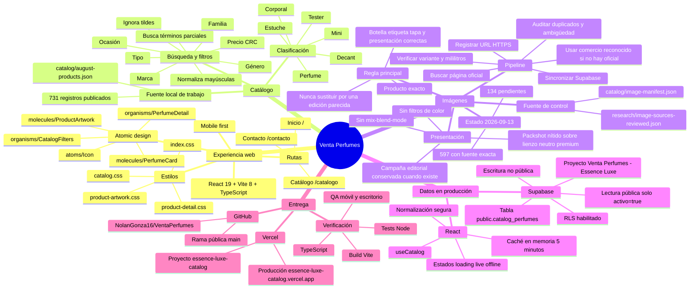

# Mapa operativo — Venta Perfumes

Este documento es la memoria técnica breve del proyecto. Debe consultarse antes de
explorar el repositorio y actualizarse cuando cambien la arquitectura, el flujo de
datos o los conteos principales.

## Flujo mínimo para imágenes pendientes

1. Obtener las referencias sin `imagen_url` desde `catalog/august-products.json`.
2. Investigar por `marca + nombre + concentración + tamaño`, priorizando la marca.
3. Rechazar coincidencias de otra edición, otro tamaño cuando cambie el empaque,
   miniaturas pobres, páginas genéricas y una misma imagen compartida por productos
   distintos.
4. Registrar únicamente coincidencias exactas en `imagen_url` y conservar evidencia
   pública en `fuentes`/`research/image-sources-reviewed.json`.
5. Ejecutar `scripts/audit_catalog_images.py`, pruebas de manifiesto y build.
6. Sincronizar solo las filas cambiadas con Supabase, verificar por consulta y
   publicar mediante GitHub/Vercel al cerrar un lote coherente.

## Enrutamiento de skills

| Necesidad | Skill/proceso | Cuándo usarlo |
|---|---|---|
| Investigar imágenes o datos | `research` (criterio de fuentes primarias) | Solo para productos pendientes y con trazabilidad |
| Cambiar o verificar datos remotos | `supabase` | Después de validar localmente un lote |
| Probar catálogo y detalles | `webapp-testing` | Tras cambios visibles o de interacción |
| Publicar | `deploy-with-vercel` | Una vez que tests y build pasen |
| Generar fondos editoriales | `imagegen` | Solo con producto exacto como referencia y cuando no exista campaña adecuada |

No se deben cargar todas las skills en cada sesión: se elige la mínima combinación
según esta tabla. Así se evita contaminar el contexto y se reduce el riesgo de
modificar áreas no relacionadas.

## Guardas importantes

- El PDF del proveedor define qué productos existen; no se agregan productos externos.
- El precio público usa costo del catálogo por `1.70`; el costo privado no se publica.
- `VITE_*` contiene únicamente configuración pública; nunca una clave `service_role`.
- Los datos desconocidos permanecen nulos o pendientes; no se inventan.
- Antes de hacer commit, revisar y excluir cambios locales ajenos al lote.
